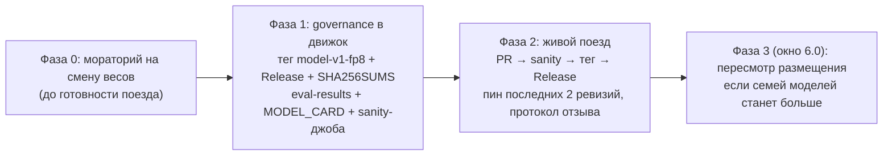

# ADR 0004: Дом реестра vesma-embed, round-4 F-конфигурация и отложенный routing-choice

- **Status:** Accepted (АрхКом vesma-cortex, 2026-10-06; санкция владельца на
  работы по конвейеру — «пускай разбираются», 2026-10-06)
- **Date:** 2026-10-06
- **Протокол:** Архитектурный комитет — роутинг-обязанность / реестр
  эмбеддера / round-4 студента, 2026-10-06 (team-local); контракт того же
  дня (team-local)

## Контекст

Одна сессия комитета закрыла три независимых вопроса, у которых общая
фундаментальная ось — эмбеддер и его телеметрия:

- **Q2 (дом реестра vesma-embed).** Артефакт и training-код эмбеддера уже
  живут в репо движка (`src/vesmaro/models/vesma-embed-v1/`), но вне
  governance-цикла: у кортекса с [ADR 0003](0003-model-artifacts-release-and-eval.md)
  есть релизный поезд (теги `model-v1-<fp8>`, GitHub Release с
  `SHA256SUMS`, `eval-results.json`, генерация `MODEL_CARD`,
  sanity-джоба), у эмбеддера — ничего: смена весов возможна в любой момент
  без гейтов, а каждое изменение байт — негейтованная инвалидация стора и
  пина кортекса. Отягчающее: CI движка был выключен вручную с 28.07
  (`state: disabled_manually`).
- **Q3 (round-4 студента).** Инвентаризация корпуса показала: реальная
  часть ≤ 2.7k записей — втрое меньше, чем считалось в round-3; источник
  8086 записей round-3 не локализован (бэкап pre-cleaninstall 2026-10-01
  на машине отсутствует). Зазор 0.9484 → 0.96 (0.0116) внутри одного CI
  (±0.0232); измеренный дефект translation-twins (sens 0.00) — дефект
  данных, размером модели не лечится. Вопрос: 30M, 45M или 60M.
- **Q1 (роутинг-обязанность).** Идея владельца «роутинг-выбор из
  кандидатов» требует решения: активировать, отложить или вписать в
  [реестр обязанностей](0002-duty-registry-v2.md). Счётчики командных
  поисков сегодня не логируются — размер «неоднозначного остатка», на
  котором модель должна оплатить себя, не измерен.

Участники: председатель (TL-сессия vesma-cortex); позиции — analytics-lead,
product-architect, neural-architect (параллельный раунд 1 с перекрёстными
побочными вопросами; раунд 2 свёрнут — расхождений между specialist'ами
не обнаружено, зафиксирован один конфликт «позиция ↔ позиция» по Q1 и один
«председатель ↔ комитет» по Q2).

## Решение

### R1. Реестр и релизный поезд vesma-embed — в репо движка (Q2)

Принят вариант **(б)** единогласно specialist'ов: реестр и релизный поезд
vesma-embed живут в репо движка vesmaro/vesma; governance-паттерн кортекса
([ADR 0003](0003-model-artifacts-release-and-eval.md)) переносится на
эмбеддер. Отдельный PyPI-пакет эмбеддеру — **НЕТ**. Артефакт = каталог
`src/vesmaro/models/vesma-embed-v1/` — ноль копирования, канонический путь
= рантайм-путь; фингерпринт версионируется рядом с рантайм-зависимостью.
Первый тег — текущая ревизия 1.1.0 (weights sha256 `3b752e06…`).

| Фаза | Содержание |
|---|---|
| **0 — немедленно** | Мораторий на смену весов `vesma-embed-v1` до фазы 2: смена сейчас = негейтованная инвалидация всего стора и пина кортекса, без поезда и без отката |
| **1** | Governance-контур в движке: тег `model-v1-<fp8>`, GitHub Release с ассетами и `SHA256SUMS`, `eval-results.json`, генерация `MODEL_CARD`, CI-джоба sanity на изменения каталога модели |
| **2** | Живой поезд: зелёный sanity на PR → тег → Release; пин последних 2 хороших ревизий; протокол отзыва зеркален [model-registry](../specs/model-registry.md) §6. Роли: режет релиз GWS, гейты верифицирует TL; движок подхватывает ревизию своим следующим релизом; кортекс перекалибровывается своей волной по факту смены пина |
| **3 — окно 6.0** | Пересмотр размещения, если семей моделей станет больше; нейминг-долг — ноль (реестр имён не трогается) |

Куплинг без изменений: смена весов → `CORTEX-E-PIN` → re-embed стора +
перекалибровка кортекса — единый поезд, заперт фазой 0 до готовности.

Блокер конвейера: `ci.yml` движка пере-включён 06.10 председателем (по
санкции владельца); `publish-npm.yml` и `release.yml` остаются выключенными
до разбора красных прогонов 28.07/01.10 — npm-канал фактически цел
(5.6.1 в реестре, публикации шли вручную). Вопрос включения — открытый,
владельцу.

### R2. Round-4 студента — конфигурация F (Q3)

Round-4 обучается в конфигурации **F**: студент 30M без изменений
архитектуры; корпус рескейлится по факту инвентаризации — реальная часть
≤ 2.7k записей (выгрузка разрешена владельцем 06.10, read-only, в репу
идут только отпечатки/счётчики), полная регенерация синтетики, RU↔EN
переводные пары ≥ 15–20% корпуса. Гейты g1–g8 — из драфта пререгистрации
(`embed-round4-prereg-DRAFT.md`, в репе пока не закоммичен — ратифицируется
вместе с аддендумом).

Три дополнения к prereg **до ратификации**:

1. секция identity-init/разогрева (zero-init выходной проекции, ReZero
   α=0, заморозка базы на 1-ю эпоху) — обязательна для будущей фазы A:
   без неё 1–3 эпохи регресса и реальный шанс провала g1;
2. рескейл корпуса (состав выше);
3. g6-baseline: латентность текущего артефакта снимается до ратификации —
   порог ≤ 10 мс сегодня не имеет baseline.

Провенанс: источник 8086 записей round-3 не локализован — для round-4
некритично (рескейл по факту инвентаризации), но факт фиксируется в
provenance.

Судьба цели: если F прошёл no-harm, но не достиг 0.96 — цель честно
пересматривается как **data-limited**; мандат владельца «лидерство»
исполняется рычагом корпуса (переводные пары, расширение judged-set), а не
параметров.

### R3. routing-choice — отложенная позиция реестра (Q1)

В реестр обязанностей [ADR 0002](0002-duty-registry-v2.md) регистрируется
**новая отложенная позиция** «роутинг-выбор из кандидатов»: примитив
Choice 1-из-k с правом воздержаться; кандидатам источник — recall/graph-
поиск движка, кортекс переупорядочивает переданный список. Поверхность
отлична от best-match: там кандидаты-recall памяти, здесь — ноды
Command/Route графа; один артефакт на обе нарушил бы принцип «одна задача
= один артефакт» ([ADR 0001](0001-archcom-a1-verdicts.md)).

Ни рабочей волны, ни активации best-match до вердикта B0 16.10.
Разблокировка требует всех четырёх условий:

| # | Условие | Статус |
|---|---|---|
| i | граф-трек логирует командные поиски (счётчики) | не выполняется — без них вердикт невозможен в принципе |
| ii | шов ранжирования в main движка (`awareness.rank_provider`) | отсутствует |
| iii | вердикт B0 от 16.10 | впереди |
| iv | препегистрация ADOPT-параметров до любого прогона | обязательна |

ADOPT-препегистрация (фиксируется до прогона): top-1 accuracy на наборах
k ∈ {2..5}; страты «близнецы»/«тема рядом»/«очевидные»; ≥ +10 п.п. к
argmax-эвристике и не хуже ни на одной страте; Brier; adversarial sanity
(урок отзыва B2, [#480](../experiments/b0-escalation.md)); ≥ 600 наборов,
holdout ≥ 276 запечатан; прод-план — shadow `CORTEX-ROUTE`, не A/B, с
контролем позиционного смещения перестановками.

Порог значимости: если доля неоднозначных событий < 10% — duty не нужен
вовсе; «остаток мал» — нормальный исход (прецедент W4c). Карточка
routing-duty-proposal остаётся в validating с этими условиями.

## Позиции и споры комитета

| Вопрос | Позиции | Решение |
|---|---|---|
| Q1 роутинг | **Analytics-lead:** новая отложенная позиция «routing-choice» со своим триггером и препегистрацией — поверхности различны. **Product-architect (dissent):** не плодить позиций до телеметрии — оставить существующую best-match с её количественным триггером; первый чекбокс — шов `awareness.rank_provider` | Принята структура Analytics (отдельная позиция, поверхности различны); dissent Product записан как альтернатива «не плодить позиций до телеметрии» |
| Q2 дом реестра | **Председатель:** вариант «а» — единый ML-дом в репо vesma-cortex. **Все specialist'ы:** вариант «б» — движок; фундамент выше потребителя; ноль копирования; PyPI — второй канал поставки весов, несовместимый с процедурой отзыва | Вариант (б) единогласно; позиция председателя отклонена комитетом (инверсия графа зависимостей — фундаментом управлял бы потребитель) |
| Q3 round-4 | **Neural-architect:** F (30M + рескейл корпуса); B отклонить по гейту размера; A — только round-5 за capacity-пробом и с identity-init в prereg | Принято председателем; лидерство исполняется рычагом корпуса, не параметров |

## Alternatives considered

| Альтернатива | Почему отвергнута |
|---|---|
| (Q1) Активация best-match сейчас | счётчики командных поисков не логируются — вердикт невозможен в принципе; экономика уже выиграна картой графа (~300 ток/команда против 18.7k `--help`), модель должна оплатить себя только на остатке, где ранжирование по сходству ошибается, а размер остатка не измерен |
| (Q1) Немедленная рабочая волна роутинга | ни волны, ни активации до вердикта B0 16.10 — телеметрия раньше телепатии (принцип 0.1 roadmap); без условия (i) даже критерий успеха не формулируем |
| (Q2) Размещение в репо vesma-cortex (вариант «а», позиция председателя) | инверсия графа зависимостей: фундаментом управлял бы потребитель; артефакт и training-код уже в движковом репо; оценочная обвязка эмбеддера всё равно новая (гейты кортекса меряют is-duplicate, не эмбеддинги); вариант режет релиз GWS, а «CI движка как блокер» — аргумент за починку CI, не за переезд |
| (Q2) Отдельный репо/PyPI vesma-embed | отдельный репо — кросс-репо координация пинов без смены владельца; смысл появится только с собственной калибровочной программой эмбеддера. PyPI — второй канал поставки весов, несовместимый с процедурой отзыва (yank — не отзыв) |
| (Q3) Вариант B (60M) в round-4 | 60–62 MB > 60 MB — гейт размера g7 нарушен до всякого обучения |
| (Q3) Вариант A (45M) в round-4 | зазор 0.9484 → 0.96 внутри одного CI (±0.0232); прирост ×1.5 параметров при фиксированном корпусе обычно < 0.005–0.01 — узкое место данные, не ёмкость; без identity-init — 1–3 эпохи регресса; A добавляет ×1.3–1.6 латентности при g6 без baseline. Переносится в round-5 за дешёвым capacity-пробом (1–2 дня CPU, 30M vs 45M identity-init, ≥ +0.005 recall@5 — условие разблокировки) |

## Последствия

- Governance-паттерн [ADR 0003](0003-model-artifacts-release-and-eval.md)
  переносится в движок: кортекс остаётся автором паттерна, движок —
  носителем для vesma-embed; межрепо-хвост байт-верификации из R1 ADR 0003
  для вендоренного артефакта сохраняет силу.
- Фаза 0 действует немедленно: до появления поезда смена весов
  `vesma-embed-v1` запрещена.
- Драфт пререгистрации round-4 дополняется (identity-init, рескейл
  корпуса, g6-baseline) до ратификации; пороги g3/g5/g6 в статусе
  PROPOSED — ратифицируются владельцем вместе с prereg.
- Реестр обязанностей [ADR 0002](0002-duty-registry-v2.md) пополняется
  строкой routing-choice (ОТЛОЖИТЬ, Choice, телеметрический триггер);
  условия разблокировки живёт в карточке routing-duty-proposal (validating).
- Capacity-проб фазы A (1–2 дня CPU, не раунд) — число для round-5
  решения; результат раньше решения не публикуется как вердикт.
- Открытые вопросы владельцу: судьба `publish-npm.yml`/`release.yml`
  движка (включать ли после разбора красных прогонов 28.07/01.10);
  ратификация prereg round-4 с порогами g3/g5/g6.

## Чеклист

- [ ] Фаза 0: мораторий на смену весов `vesma-embed-v1` объявлен и действует до фазы 2
- [ ] Фаза 1: governance-контур в движке — тег `model-v1-<fp8>` на ревизии 1.1.0 (`3b752e06…`), Release + `SHA256SUMS`, `eval-results.json`, `MODEL_CARD`, sanity-джоба
- [ ] `ci.yml` движка зелёный после пере-включения 06.10
- [ ] Prereg-аддендум round-4: identity-init/разогрев + рескейл корпуса + g6-baseline — до ратификации
- [ ] g6-baseline латентности текущего артефакта снят
- [ ] Фаза 2: живой поезд (PR → sanity → тег → Release), пин последних 2 хороших ревизий, протокол отзыва зеркален [model-registry](../specs/model-registry.md) §6
- [ ] Реестр [ADR 0002](0002-duty-registry-v2.md) дополнен позицией routing-choice (ОТЛОЖИТЬ)
- [ ] Shadow-план `CORTEX-ROUTE` прописан (контроль позиционного смещения перестановками)
- [ ] Фаза 3 (окно 6.0): пересмотр размещения при росте числа семей моделей

## Ссылки

- Протокол АрхКома «роутинг-обязанность / реестр эмбеддера / round-4
  студента», 2026-10-06 (team-local, хранится вне репы) — вердикты,
  позиции делегатов, свернутый раунд кросс-критики.
- Контракт «релизный поезд vesma-embed в репо движка + round-4
  F-конфигурация + отложенный routing-choice», 2026-10-06 (team-local) —
  фазы поезда, параметры F, ADOPT-препегистрация routing-choice.
- [ADR 0003](0003-model-artifacts-release-and-eval.md) — governance-паттерн,
  переносимый на vesma-embed; [model-registry](../specs/model-registry.md)
  §6 — протокол отзыва, зеркалируемый поездом движка.
- [ADR 0002](0002-duty-registry-v2.md) — реестр обязанностей, пополняемый
  позицией routing-choice; [ADR 0001](0001-archcom-a1-verdicts.md) —
  «одна задача = один артефакт», реестр имён.
- [Протокол отзыва B2](../experiments/b0-escalation.md) — источник
  adversarial-sanities требования в ADOPT.
