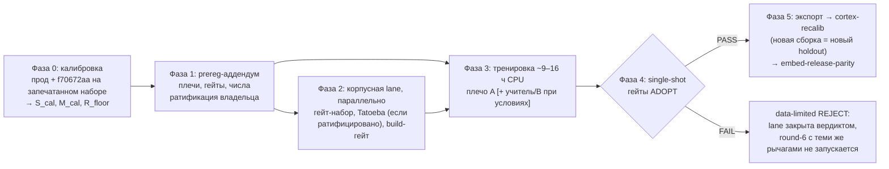

# ADR 0005: Round-5 vesma-embed — решающая гибридная попытка кросс-языкового выравнивания

- **Status:** Accepted (conditional — АрхКом vesma-cortex, 2026-10-08;
  единодушие после фазы критики, две оговорки записаны. Числа порогов
  (калибровка, фаза 0) и вопросы §6 контракта ожидают ратификации
  владельца; до неё исполнение не начинается)
- **Date:** 2026-10-08
- **Протокол:** Архитектурный комитет — round-5 vesma-embed: стратегия
  (решающая попытка кросс-языкового выравнивания), 2026-10-08 (team-local,
  хранится вне репы); контракт того же дня (team-local)

## Контекст

Round-4 (конфигурация F из [ADR 0004](0004-embed-train-routing.md), R2)
завершён вердиктом **REJECT**: g1 0.9406 PASS, g2 <0.96 FAIL, g3 (MRL)
FAIL, g6a 16.5 мс PASS. Продукция остаётся на round-3 (weights sha256
`3b752e06…`). Тем самым открыт зафиксированный в ADR 0004 сценарий «цель
честно пересматривается»: no-harm удержан, целевой лифт — нет.

Диагностика post-factum показала, что рычаг round-4 — рецептура RU↔EN
(15.84% корпуса) — работает, но сублинейно: translated-dup медиана
поднялась 0.7444 → 0.8116 (+0.0692, 144/144 пар; одноязычный контроль
чист). Это **IMPROVED, not CURED**: каждый проход даёт ~+0.07, режима
≥0.85 масштабирование рецептуры не достигает. Корневая гипотеза
Neural-architect: посрезовая KD поточечна — лосс никогда не видит
переводную пару как пару, поэтому потолок студента = геометрия учителя
на переводах (~0.82–0.85).

Второй дефект round-4 — **gate-gap**: прег-гейты измеряли прокси-геометрию
(косинусы пар) и ни разу — цель корпуса, двуязычный retrieval. Метрика,
которую оптимизирует объектив, не является независимой проверкой (Гудхарт);
round-4 прошёл бы свои гейты, не приблизившись к продуктовому результату.

Ставка продуктовая: двуязычность — структурное свойство продукта. Класс
отказа «сохранил на одном языке, спросил на другом — тишина» немой и рушит
доверие; латентность и автономия узким местом не являются.

Участники: председатель `@GCW: Tech Lead` (инженерный владелец);
`@GCW: Product Architect`, `@GCW: Neural Architect`, `@GCW: Dataset
Engineer`, `@GCW: ML Engineer` (исполнитель round-4). Единодушие после
фазы критики; главный спор (форма гейта) разрешён развязкой председателя.

## Решение

Round-5 утверждён как **решающая попытка гибрида**. Главный рычаг —
translation-контрастивный член лосса поверх посрезовой KD **на
существующих 4038 парах** (чистая атрибуция лосса: данные не меняются).
Кросс-языковой retrieval становится binding-гейтом ADOPT; косинусный
прокси понижен до training-loop правила. Честный data-limited выход
легален и финален.

### R1. Целевая функция (плечо A, база)

Существующая посрезовая KD (MSE на cos к вектору учителя, срезы
64/128/256/384 с L2-ренормализацией) + translation-контрастивный член:
позитив — переводная пара, негативы — in-batch (при CPU-батчах <32 —
парная cos-функция; финальная механика фиксируется в аддендуме).
λ/температура — пилотная сетка на 25% корпуса до полного прогона.
Контрастив считается посрезово ИЛИ на полном векторе — по выбору из
пилота. `--mrl-weights "4,2,1,1"` включён в базовый конфиг (флаг уже в
тренере; решающесть важнее чистоты; особое мнение Neural-architect —
пакетировать в round-6 — записано как fallback). Урок round-4
(недообученность: кривая не на плато к 10-й эпохе) — 16–20 эпох + прег-
правило ранней остановки (<0.001 val R@5 четыре оценки подряд) +
slice-aware селекция min-over-slices.

### R2. Условные плечи

Все плечи прег-регистрируются в одном аддендуме; ёмкость — последний
рычаг (позиция Product-architect). Отложенный в ADR 0004 capacity-проб
(вариант A/45M) реализуется этим плечом.

| Плечо | Состав | Условие запуска | Цена |
|---|---|---|---|
| **A (база)** | контрастив на существующих 4038 парах, KD-учитель 0.6B | всегда | ~9–10 ч |
| **Учитель** | тот же лосс на векторах аудированного KD-учителя лёгкого мультиязычного класса (e5-base MIT / LaBSE Apache-2.0 / MiniLM); аудит: медиана ≥0.90 на 144 парах + одноязычный зонд \|Δ\|≤0.005 тем же харнесом | аудит PASS | +~6 ч |
| **B (корпус)** | тот же лосс на пере-переведённом корпусе (все 4038 строк новым переводящим учителем по 50-парной chrF-пробе; поколения не смешивать) | DE-lane успела с пробой и build-гейтом | +2–6 ч |
| **A/45M** | тот же лосс на 45M-студенте (identity-init ReZero) | триггеры: train-loss падает, гейт стоит; g2-gap ≤0.01 | +5.1 ч |

Правило атрибуции: вектора разных KD-учителей не переиспользуются;
гейт-набор при плече B не пере-переводится (замороженные поверхности =
сравимость). Если успело только B без A — один прогон B с честной
пометкой «вклад данных не изолирован».

### R3. Гейт-архитектура

**ADOPT = g1 ∧ retrieval-lag ∧ retrieval-abs ∧ gX0 ∧ g6a ∧ g7.**
Механика гейтов — до аддендума; числа — после калибровки; ратификация —
владельца. После ратификации пороги не двигаются.

Калибровка — **одна характеризация до аддендума**: прод `3b752e06…` +
REJECT-кандидат `f70672aa` на запечатанном гейт-наборе + retrieval-харнес
(рецепт диагностики round-4, воспроизвёл build-вектора обеих моделей
точно) → полы S_cal (доля ≥0.85), M_cal (медиана), R_floor (R@5).
Это характеризация, не переролл: REJECT-кандидат уже отобран вердиктом.

| Гейт | Роль | Форма |
|---|---|---|
| g1 | binding ADOPT | S1m no-harm ≥0.9252 (без изменений) |
| **retrieval-lag** | binding ADOPT | R@5 кросс-языковой ≥ одноязычный − 0.05, оба направления |
| **retrieval-abs** | binding ADOPT | max(R_floor + 0.20, 0.75); цель PA 0.90 — ратифицированная мишень, калибровка показывает дистанцию |
| gX0 | binding guard | \|Δ\| медианы одноязычного контроля ≤0.005 против прода |
| g6a / g7 | binding ADOPT | ≤45 мс / ≤60 МБ (без изменений; для плеча 45M — перемер) |
| gX1 (косинусный прокси) | training-loop правило | доля пар cos ≥0.85 ≥ max(50%, S_cal + 20 п.п.); медиана ≥ max(0.84, M_cal + 0.03); feasibility: если S_cal + 20 п.п. > 70% — комитет пере-скоупит ДО прогона |
| g2 | монитор | значение фиксируется для тренда/атрибуции; лифт-функция передана retrieval-гейту; защитный остаток no-regression — g1 ∧ gX0 |
| g3 | монитор (re-arm) | замер остаётся в проходе (бесплатно, относительно прода); возвращается в binding при появлении потребляющей поверхности срезов (ратификация владельца) |

Развязка председателя по спору о форме гейта: прокси-гейт binding для
решений расхода CPU (ранняя остановка, плечи), retrieval — binding для
ADOPT. Прокси-геометрия ни при каком значении не открывает ADOPT.

**Запечатанный гейт-набор:** 150–200 переводных пар, вырезаны из
translated-семейства ДО сплитов, стратифицированы по источнику; SHA-256
списка pair_id и поверхностей — в аддендуме; исключены из обучения И из
плеча B; ассерты дизъюнктности (pair_id train∩gate=∅, holdout∩gate=∅;
n-граммы 8–13); баланс направлений. 144 сожжённые пары round-4 —
contaminated, годятся только для тренда.

**Однострельность:** измерение гейтов ADOPT — ровно один проход на
выбранном чекпоинте.

### R4. Решающая форма и легальный data-limited выход

Round-5 — последняя попытка с перечисленными рычагами. Провал двуязычного
гейта после гибридной попытки закрывает lane вердиктом: «двуязычная
глухота — известное ограничение»; round-6 с теми же рычагами не
запускается. Data-limited REJECT — легальный финал, а не провал команды:
мандат «лидерство» из [ADR 0004](0004-embed-train-routing.md)
исполняется рычагом корпуса ровно до исчерпания license-clean данных.

| Фаза | Что | Гейт |
|---|---|---|
| 0 | Калибровка (характеризация прод + кандидата; retrieval-харнес с дистракторами) | числа порогов готовы |
| 1 | Prereg-аддендум round-5 (плечи, гейты, числа) | владелец ратифицировал |
| 2 | Корпусная lane параллельно: гейт-набор, Tatoeba (если §6.3 = да), build-гейт | ассерты сборки PASS |
| 3 | Тренировка (плечо A [+ учитель/B при условиях]) | val-селекция |
| 4 | Single-shot гейты ADOPT | вердикт |
| 5 | ADOPT: экспорт → cortex-recalib → embed-release-parity; REJECT (data-limited): lane закрывается вердиктом | — |

Продуктовый смысл успеха (формулировка Product-architect): память
сохранена на одном языке, запрос на другом — запись в первой пятёрке с
надёжностью одноязычного запроса в пределах шума. Проверяется
retrieval-гейтом, не прокси-геометрией.

## Позиции и споры комитета

| Вопрос | Позиции | Решение |
|---|---|---|
| Форма гейта | **Product-architect:** retrieval обязателен binding для ADOPT с первого прогона (Гудхарт: иначе round-4 повторяется зеркально). **Neural-architect / ML-engineer:** прокси-гейт как основной, retrieval после | Развязка председателя: прокси binding для расхода CPU (ранняя остановка, плечи), retrieval binding для ADOPT; ML-engineer принял после собственного подсчёта (+5–10 мин к проходу) |
| Пороговые числа | **Neural-architect:** 60%/0.86 априори. **ML-engineer:** 25–30% после калибровки. **Product-architect:** минимум 50% | Априорные числа сняты в пользу калибровки с клампами; пол прокси-доли поднят до 50% (PA-минимум); feasibility-оговорка о re-scope |
| KD-учитель | **ML-engineer (изначально):** против смены учителя. После пересчёта механики (0.8–1.5 ч переразметки против 2.9 ч) принял условное плечо | Условное плечо после аудита e5-класса (медиана ≥0.90 на 144 парах + одноязычный зонд \|Δ\|≤0.005) |
| Переводящий учитель | **Dataset-engineer:** смена переводящего учителя + пере-перевод всех 4038. **Neural-architect:** шум метки не ломает InfoNCE (round-4 двигал 100% пар позитивно на «шумном» корпусе) | Развязка плечами A/B: база — контрастив на существующих парах; пере-перевод — параллельная корпусная работа, питающая плечо B |
| MRL-контур | **Neural-architect:** пакетировать mrl-weights в round-6 (особое мнение записано). **ML-engineer:** включить в базовый конфиг | `--mrl-weights "4,2,1,1"` в базу (флаг уже есть, всё тянет в одну сторону); slice-aware селекция — в базу; g3 мониторируемая с re-arm триггером; понижение решающего веса g3 ратифицирует владелец |
| g2 | единая формула PA+NA | лифт-порог 0.96 снимается, «кандидат лучше» наследует кросс-языковый гейт; защитный остаток no-regression — g1 ∧ gX0; значение остаётся мониторируемым |

## Alternatives considered

| Альтернатива | Почему отвергнута |
|---|---|
| Чистое (a): масштабирование рецептуры | сублинейно (+0.069/проход по факту round-4), потолок = геометрия учителя; риск третьего IMPROVED-not-CURED; инкремент, не режим ≥0.85 |
| KD-учитель 4B-класса | 18–24 ч предрасчёта + RAM-риск; заменён аудитом лёгкого учителя e5-класса (минуты аудита, единицы часов переразметки) |
| Two-tower / претрейн-стадия на 4k парах | три порядка разницы с нормами рецептов класса LaBSE — данных недостаточно на порядки |
| Ёмкость B/60M | арифметика гейта размера g7 (решение 06.10, [ADR 0004](0004-embed-train-routing.md)) — нарушен до всякого обучения |
| Гейт на train-производных 144 парах | загрязнение: пары видны обучению; только тренд, не ADOPT |
| Априорные пороги прокси (60%/0.86; 50%) | числа без измеренной базы; заменены калибровочной процедурой с клампами (одна характеризация до аддендума) |
| Инкрементальный round-5 (только лёгкое масштабирование) | продуктово отклонён: держит cortex-recalib заблокированным 4-й раунд, не покупая режим |
| Ожидание B0-вердикта 16.10 до старта round-5 | recalib зависит от round-5 в любом случае; прегейт-инфраструктура round-5 конвертируется в B0-дизайн (хук «язык запроса × язык памяти × исход retrieval») |

## Последствия

- Binding-гейтом ADOPT становится продуктовая форма (двуязычный
  retrieval), а не прокси-геометрия объективa — gate-gap round-4 закрыт
  архитектурно, а не порогом.
- Прокси-гейт (gX1) сохранён как training-loop правило: ранняя остановка
  и триггеры плеч решаются по нему бесплатно; ADOPT он не открывает.
- Числа порогов появляются только после калибровочной характеризации
  (фаза 0) и ратифицируются владельцем вместе с prereg-аддендумом; после
  ратификации пороги не двигаются, гейты ADOPT однострельны.
- Запечатанный гейт-набор строится корпусной lane'ю (DE) параллельно
  фазе 1 и исключается из обучения и из плеча B — дизъюнктность
  ассертами сборки; 144 пары round-4 признаются contaminated (только
  тренд).
- Плечо 45M остаётся вне базовой конфигурации: включение требует
  перемера g6a/g7 —runtime дорожает навсегда, ёмкость платится последней.
- g3 понижена до мониторируемой с re-arm триггером; возврат в binding
  и появление потребляющей поверхности срезов ратифицирует владелец —
  молча отпускать свойство, которое потом стоит раунда, нельзя.
- ADOPT-исход запускает стандартный поезд из [ADR 0004](0004-embed-train-routing.md):
  экспорт → cortex-recalib (новая сборка = новый holdout) →
  embed-release-parity; data-limited REJECT закрывает lane финально.
- Открытые вопросы владельцу (§6 контракта): (1) санкция на старт
  round-5; (2) появится ли в 2 раундах потребляющая поверхность
  MRL-срезов (нет → g3 остаётся мониторируемой, round-6 пакет отменяется);
  (3) разрешены ли license-clean публичные загрузки (Tatoeba CC-BY
  с атрибуцией; нет → страта 0, композиция ~25.5k, потолок translated-
  доли без изменения — готовый откат DE).

## Чеклист

- [ ] Фаза 0: калибровочная характеризация (прод `3b752e06…` + `f70672aa` на запечатанном наборе, retrieval-харнес) — S_cal, M_cal, R_floor сняты
- [ ] Фаза 1: prereg-аддендум round-5 (плечи, механика гейтов, калиброванные числа, SHA-256 гейт-набора) составлен и ратифицирован владельцем
- [ ] Вопросы §6 контракта решены владельцем: старт round-5, g3-потребители, local-only/Tatoeba
- [ ] Фаза 2: запечатанный гейт-набор 150–200 пар собран, ассерты дизъюнктности PASS; Tatoeba-страта (если ратифицирована); build-гейт `assert_crosslingual_corpus_gate` откалиброван по round-4 корпусу
- [ ] Фаза 3: тренировка плеча A (+условные плечи по их триггерам), ранняя остановка по прег-правилу
- [ ] Фаза 4: single-shot гейты ADOPT измерены ровно одним проходом, вердикт записан
- [ ] ADOPT: экспорт → cortex-recalib → embed-release-parity / REJECT: lane закрыта вердиктом «двуязычная глухота — известное ограничение»
- [ ] B0-lane: хук «язык запроса × язык памяти × исход retrieval» учтён в подготовке вердикта 16.10

## Ссылки

- Протокол АрхКома «round-5 vesma-embed: стратегия (решающая попытка
  кросс-языкового выравнивания)», 2026-10-08 (team-local,
  `2026-10-08-vesma-cortex-embed-round5-protocol.md`, хранится вне репы).
- Архитектурный контракт round-5, 2026-10-08 (team-local,
  `2026-10-08-vesma-cortex-embed-round5-contract.md`) — плечи, формы
  гейтов, фазы, остаточные риски, вопросы владельцу.
- Сводка позиций комитета, 2026-10-08 (team-local,
  `2026-10-08-vesma-cortex-embed-round5-positions.md`).
- Vesma-решение комитета: id `9a38903e-5121-4419-8086-ec1fe85598ff`
  (tags: `project:vesma-cortex`, `mnemos:decision`, `committee`).
- [ADR 0004](0004-embed-train-routing.md) — round-4 конфигурация F,
  отложенный capacity-проб A/45M (реализован плечом настоящего ADR),
  релизный поезд артефакта; [ADR 0003](0003-model-artifacts-release-and-eval.md) —
  governance-паттерн, в который встаёт ADOPT-исход.
- Механика лосса и артефакты-входы: `docs/reports/vesma-embed-model-report.md`;
  gate JSONs и экспорт round-4 — `vesma/wt/embed-r4-train/training/runs/embed-r4/`;
  диагностика translated-dup — `/tmp/vesma-r5-embeddiag/` (нежурналируемая,
  цифры зафиксированы в настоящем ADR и контракте).
