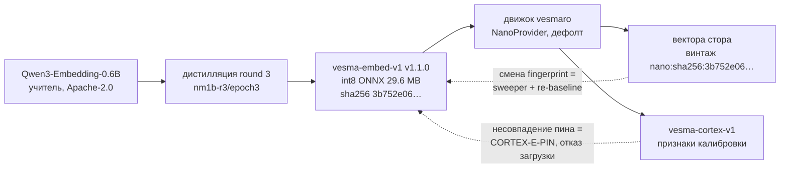

# vesma-embed-v1 (ранее mnema-embed-v1): эмбеддер семейства — дистилляция, винтаж, цепочка доверия

- **Статус:** round-3 веса в проде движка с 2026-09-13; переименование `mnema-embed-v1` → `vesma-embed-v1` на main движка 2026-10-01 (hash-preserving, веса не менялись)
- **Тип документа:** продуктовый пруф — накапливает доказательства для продвижения; каждое число взято из файлов движка (путь указан) либо явно помечено как непроверенное
- **База верификации:** worktree движка @ `0046526` (2026-09-30) + коммиты `origin/main` по 2026-10-01 включительно; первичный чекаут (ветка `release/5.1.0`) не читался
- **Смежный отчёт:** [vesma-cortex-model-report.md](vesma-cortex-model-report.md) — модель решений, запиненная на этот эмбеддер

## Executive summary

**vesma-embed-v1** — собственный эмбеддер движка vesmaro: дистиллят учителя `Qwen/Qwen3-Embedding-0.6B`, 384-dim, мультиязычный RU+EN, int8-квантованный ONNX **29 641 498 байт**, едет в основном wheel — ноль сети, ноль ключей, ноль скачиваний при установке. Это фундамент векторной ноги гибридного поиска и источник признаков для калиброванной модели решений vesma-cortex-v1.

Две инженерные особенности отличают его от «просто модели в пакете». Первая — **винтажность**: каждый вектор стора штампуется отпечатком весов, и смена эмбеддера запускает полный пере-эмбеддинг корпуса через фоновый sweeper, а S1m-гейт требует re-baseline в том же PR. Вторая — **цепочка доверия вниз по семейству**: vesma-cortex-v1 хранит пин `nano:sha256:3b752e06…` в метаданных артефакта и отказывает загрузку при несовпадении (`CORTEX-E-PIN`). Эмбеддер — не деталь реализации, а контракт, на котором стоят потребители.

| Показатель | Значение | Источник |
|---|---|---|
| Размерность / max_seq | 384 / 256 токенов | manifest.json движка |
| Артефакт | int8 ONNX 29 641 498 байт, opset 15, tokenizer.json 1 741 861 байт | `src/vesmaro/models/`, размер файлов |
| Студент | 30 298 320 параметров (`epoch3`, init `rubert-tiny2`) | manifest.json |
| Учитель | Qwen3-Embedding-0.6B (Apache-2.0, 596M параметров) | manifest.json, training/README.md |
| MRL-головы | 64 / 128 / 256 / 384 | manifest.json |
| Weights sha256 | `3b752e06…d84317ba` (полный — в manifest) | manifest.json, BASELINE.md |
| S1m recall@5 (baseline 2026-09-15) | **0.9484** (CI95 ±0.0232), MRR 0.9093, nDCG@10 0.9117 | BASELINE.md §10 |
| Fingerprint в рантайме | `nano:sha256:<weights_sha256>` | embeddings/__init__.py |

## Задача: эмбеддинги как фундамент памяти

У эмбеддера в движке три роли. Векторная нога гибридного поиска: семантическая близость при лексическом промахе. Винтажный ключ дедупликации векторов: отпечаток весов отличает «вектор от другого эмбеддера» от «вектор от устаревшего контента». Источник признаков для vesma-cortex-v1: косинусы пар записей, на которых калиброван советчик дедупликации.

Продуктовая рамка зафиксирована ADR-0021: **«продаём автономию, а не модель»** — метрика успеха чартера «установка → первый поиск без сети, ключей и конфигурации». Ниша подтверждена исследованием: готового мультиязычного трансформерного эмбеддера <100M не существовало — MiniLM-multilingual 118M выше бюджета, bge-micro EN-only, `rubert-tiny2` RU-центричен со слабым EN (`docs/project/nano-model-plan.md`).

Разделение ответственности в гейтах принципиально: S1-референс — детерминированный BLAKE2b lexical embedder, он измеряет механику выдачи; семантику векторов измеряет отдельный контур S1m на production-эмбеддере. Смешивать их запрещено дизайном (BASELINE.md §10: self-comparison only, never against the BLAKE2b reference).

## Архитектура

### Дистилляция (round 3, training/)

- KD-loss: MSE на cos-similarity к учителю с temperature-скейлом (`training/distill.py`).
- Геометрия учителя Qwen3 — last-token pooling с left padding и instruct-префикс на query-стороне (`Instruct: Given a memory note, retrieve similar notes\nQuery: …`); учителя BERT-класса (round 1–2, MiniLM) остаются на mean-pooling — механика выбирается автоматически (`--teacher-pooling auto`, training/README.md).
- Студент: init `cointegrated/rubert-tiny2`, 3 эпохи, batch 32; чекпоинт `training/runs/nm1b-r3/epoch3` (manifest.json `source_checkpoint`).
- MRL-головы (Matryoshka): loss — сумма KD по срезам 64/128/256/384 с L2-ренормализацией каждого среза; веса голов равные по умолчанию, опция `--mrl-weights "4,2,1,1"` (training/README.md).
- Корпус round 3: ~100k пар «текст → вектор учителя», из них 8086 реальных записей стора владельца (RU 41.9 %); fingerprint датасета `b27f8cf0…` зафиксирован в manifest (`docs/en/architecture/overview.md`, manifest.json `dataset_fingerprint`).
- Фиксы пилота NM-1b (PR #218): projector сохраняется в чекпоинтах (ко-адаптация), экспорт включает projection head, static-1 int8 калибровка.

### ONNX-граф и рантайм

Граф экспортирован с opset 15 в статичной форме batch-1×256, квантование — int8 static PTQ (`training/export_onnx.py`). Mean-pooling и L2-нормализация выполняются **внутри графа**: провайдер обязан не пере-пуулить и не пере-нормализовать выход (`src/vesmaro/embeddings/__init__.py`, докстринг NanoProvider). Батчи эмбеддятся по одному тексту — та же дисциплина, что на eval-стороне обучения.

`NanoProvider` (ключ провайдера `nano`, дефолт с NM-1c) работает на `CPUExecutionProvider`; число потоков — `VESMARO_ORT_THREADS`, иначе `OMP_NUM_THREADS`, иначе 4; `inter_op=1`. Загрузка — eager, с smoke-inference на слове `test` при инициализации. Токенизатор паддит вход до 256 токенов, attention_mask используется как есть — ручная маска «по числу токенов» была бы all-ones и замусорила бы графовый mean-pooling паддингами (review F1, PR #218).

MRL-головы 64/128/256 в рантайме движка **не потребляются**: поиск по `src/` не находит использования `mrl` вне manifest; провайдер отдаёт полный 384-вектор. Возможность записана, путь использования — нет (см. Ограничения).

### Размер и скорость

Размер верифицирован: 29.6 MB ONNX + 1.7 MB tokenizer — вдвое меньше плана ADR-0021 (50–60 MB) и с запасом под лимит PyPI 100 MB на файл. Скорость в репо **не измерялась**: стенд S2-timing намеренно гоняет детерминированный lexical embedder, чтобы мерить движок, а не модель; оценка «1–5 ms/text» в ADR-0021 — плановая прикидка, не измерение.

## Дисциплина fingerprint/vintage (ADR-0021)

Формат отпечатка nano-провайдера — `nano:sha256:<weights_sha256>`: сильнейший доступный ключ, меняющийся ровно тогда, когда меняется геометрия эмбеддингов. Внешние провайдеры честно ограничены coarse-ключами (`ollama:<model>`, `onnxhub:<id>@<revision>`, `st:<name>`) — они детектируют смену модели, но не тихое обновление весов на стороне сервиса; ограничение задокументировано в базовом контракте.

Механика винтажности: каждый upsert штампует вектор парой `content_hash` + `model_fingerprint`; sweeper `heal_stale_embeddings` ре-эмбеддит строки с чужим отпечатком, страницами проходит весь refined-набор (головное окно не могло бы осушить полную миграцию), работает на attempt-бюджете (лимит 200 попыток за тик) и обрывается по серии подряд идущих отказов — мёртвый эмбеддер не сжигает проход (`src/vesmaro/manager.py`). `vesma doctor` считает vintage-mismatch через конфигурационного двойника `config_fingerprint` — тот же отпечаток, что построил бы провайдер, но без инстанцирования сессии.

Гейт-сторона (NM-0): `model_fingerprint` `{provider, model, weights_sha256, opset}` запинен в baseline; прогон с чужим отпечатком — RED с требованием re-baseline в том же PR; мутационный тест «тихая подмена весов» гарантированно красный. До NM-0 production-эмбеддер не был заземлён вовсе — QA-блокер «S1 гейтит референс, но не прод-эмбеддер» был закрыт именно этим контуром (ADR-0021, CHANGELOG NM-0).

## Качество: методика S1/S1m и история раундов

### Методика

Judged-корпус `c2ce056d…`, 191 judged-запрос; прогон детерминирован (нет часов, RNG, сети), S1 укладывается в бюджет <30 c. S1m — тот же корпус через production-эмбеддер; коридор — self-comparison `baseline − max(0.02; CI95)`; для model_fingerprint коридор — точное совпадение. Внешние наборы (MTEB) — informational only, воротами не являются (ADR-0021 NM-0).

### Текущий baseline (2026-09-15, weights `3b752e06…`, BASELINE.md)

| Метрика | S1m (production) | 95% CI |
|---|---:|---:|
| recall@5 | **0.9484** | ±0.0232 |
| recall@10 | 0.9754 | ±0.0163 |
| MRR | 0.9093 | — |
| nDCG@5 / nDCG@10 | 0.8994 / 0.9117 | — |
| precision@5 | 0.2513 | ±0.0149 |

Коридоры, выведенные из этого baseline: `s1m recall_at_5 ≥ 0.9252`, `recall_at_5 (референс) ≥ 0.9121` (референс 0.9409, CI ±0.0288); инварианты (injection-acceptance 1.0, ноль чужих проектов, ноль карантинных утечек) — точные, через re-baseline не переносятся.

### История re-baseline событий

Числа между разными событиями напрямую не сравнимы — менялся ранжирующий стек вокруг модели; сравнимы только пары «до/после» внутри одного события.

| Дата | Событие | Смена | Измерение | Источник |
|---|---|---|---|---|
| 2026-09-03 | NM-0: первый пин прод-эмбеддера | chromadb MiniLM (`4f148ba8…`) | S1m recall@5 **0.9787** на корпусе 47 запросов (позднее расширен) | CHANGELOG, NM-0 |
| ~2026-09-03 | NM-1c: nano-артефакт дефолтом, chromadb удалён | → nano round-1/2 (`fc61e797…`) | S1m **0.8745**, S1-референс 0.8637 (191 запрос, корпус `c2ce056d…`) | BASELINE.md @ `4adc1af` |
| 2026-09-13 | round-3 swap, owner-approved | → Qwen3-дистиллят (`3b752e06…`) | S1m 0.87452 → **0.863002** (−0.0115, внутри CI95 ±0.0439 — без регрессии за коридором) | commit `b180a50` |
| след. неделя | стек ранжирования: hybrid_alpha 0.7→0.5, search v2, short-token guard | эмбеддер не менялся | S1-референс 0.9030 → 0.9366 → 0.9409; S1m → 0.9275 → **0.9484** | ADR-0029, CHANGELOG |
| 2026-09-15 | текущий baseline | — | таблица выше | BASELINE.md |

Справка по памяти проекта: формулировка «re-baseline PASS — recall@5 0.9366 → 0.9409» описывает сдвиг **S1-референса** (BLAKE2b, механика выдачи) от short-token guard'а ADR-0029, а не эффект смены эмбеддера. Эффект самого round-3 на модельный контур — 0.8745 → 0.8630: измеренное падение в пределах доверительного интервала, принятое без регрессии за коридором. Память склеила два разных события; в репо они разделены.

## Место в семействе и цепочка доверия

Имя артефакта менялось трижды при неизменной дисциплине: `nano-embed-v1` (NM-1c) → `mnema-embed-v1` (NM-1d, финальное имя этапа, PR #225) → `vesma-embed-v1` (ребрендинг 2026-10-01, commit `c341698` на origin/main). Переименование hash-preserving: веса байт-в-байт те же, fingerprint `nano:sha256:3b752e06…` не изменился — ни один пин не инвалидирован; каталог старого имени грузится как fallback до 6.0 (`_LEGACY_ARTIFACT_DIRS` в embeddings/__init__.py @ `c341698`).

Цепочка вниз к vesma-cortex-v1 верифицирована по обеим сторонам. В cortex-репе: `scripts/stage2_run.py` запинал `DEFAULT_EMBEDDER_PIN = nano:sha256:3b752e0671a5…d84317ba` на этапе построения корпуса, пин уезжает в метаданные артефакта; спека инференса (`docs/specs/inference-v1.md`) требует ассерт `embedder_pin` при загрузке — несовпадение с живым fingerprint движка даёт ошибку `CORTEX-E-PIN` и отказ загрузки. В движке: смена весов меняет fingerprint, что запускает пере-эмбеддинг стора и требует re-baseline. Итог: **любая смена эмбеддера — событие перекалибровки всех потребителей по построению, а не по договорённости**.

## Ограничения

Честный раздел; каждый пункт — граница применимости, не скрытый дефект.

1. **Скорость инференса не измерялась в репо.** Стенд S2 намеренно использует lexical embedder; «1–5 ms/text» из ADR-0021 — план-оценка. Для продуктовых заявлений о скорости нужно измерение на nano-провайдере.
2. **Внешних сравнений нет.** MTEB и прочие внешние наборы ADR-0021 объявил informational only; ни одного прогонa против внешних моделей в репо не зафиксировано. Утверждение «наш эмбеддер лучше X» из репы не следует.
3. **MRL-головы 64/128/256 экспортированы, но не потребляются рантаймом**: отдельного пути нарезки с L2-ренормализацией в движке нет; нарезка без неё исказила бы геометрию.
4. **max_seq 256** — статичная форма графа; более длинные тексты обрезаются токенизатором.
5. **Корпус оценки домен-специфичен**: 191 judged-запрос RU/EN инженерного стора владельца; перенос на другие домены и языки не измерялся.
6. **int8 static PTQ**: бит-тождественность между x86_64 и arm64 не требуется (ADR-0021), кросс-арх дельты — informational; per-arch baseline-строки удваивают поддержку.
7. **S1m-числа между событиями не сравнимы** (менялся ранжирующий стек); корректны только пары внутри события — см. таблицу истории.
8. **Контейнер обучения «nano-llm» (Intel Arc 140T XPU)** — по памяти проекта, в репо не верифицировано. Верифицируемая часть: `training/distill.py` поддерживает CPU и Intel iGPU через IPEX (`torch.xpu`), обучение выполняется в контейнере (training/README.md).
9. **Снимок базы верификации отстаёт от main**: worktree `0046526` (2026-09-30) на 34 коммита позади `origin/main`; rename-коммит цитируется из origin/main (`c341698`). Публикуемые веса 5.1.x — те же `3b752e06…`.

## Воспроизводимость и провенанс

- Обучение отделено от рантайма (anti-scope ADR-0021): `training/` не попадает в wheel/sdist, не импортируется движком, не запускается в CI — CI проверяет только hash артефакта.
- Пайплайн одной командой: `training/run_pilot.sh` (prepare → distill → export → eval); датасет детерминирован (seed 42, train/val 95/5), приватный стор владельца подключается read-only (`--from-mnemos-db`, только поле content).
- Manifest самодостаточен для провенанса: учитель, чекпоинт, fingerprint датасета, MRL-размерности, opset, флаг квантования.
- Один хеш на всю цепочку: `weights_sha256` из manifest = S1m `model_fingerprint` = винтаж векторов стора = пин vesma-cortex. Подмена файла меняет все четыре одновременно и ни один не остаётся незамеченным.
- Ревизии: worktree `0046526` (2026-09-30, файла модели `mnema-embed-v1`); `origin/main` `c341698` (2026-10-01, `vesma-embed-v1`, веса байт-в-байт те же). Работа в движке велась строго read-only.

## Источники

Движок vesmaro (worktree `a2-engine-readonly` @ `0046526`, если не указано иное):

- `docs/project/adr/0021-nano-model-track.md` — трек NM-0…NM-4, S1m-контур, безопасность артефакта
- `docs/project/nano-model-plan.md` — план NM-1a/b, ниша рынка, рецепт KD
- `docs/project/adr/0029-search-v2-query-semantics.md` — измеренные сдвиги референса 0.9030→0.9366→0.9409
- `docs/en/architecture/overview.md` — состав корпуса round 3, винтажная механика
- `src/vesmaro/models/mnema-embed-v1/manifest.json`, `model.onnx`, `tokenizer.json` — артефакт и метаданные
- `src/vesmaro/embeddings/__init__.py` — NanoProvider, fingerprint-контракт, config_fingerprint, миграция NM-1c
- `src/vesmaro/manager.py` — `heal_stale_embeddings` (винтажный sweeper)
- `benchmarks/baselines/BASELINE.md` (создан 2026-09-15) — текущий baseline S1/S1m и коридоры
- `benchmarks/stands/s1_quality/{run.py,model_contour.py}` — методика S1/S1m
- `benchmarks/stands/s2_timing/run.py` — подтверждение, что timing меряет lexical embedder
- `training/{README.md,distill.py,export_onnx.py,eval_distilled.py}` — рецепт дистилляции round 3
- `CHANGELOG.md` — записи NM-0, NM-1c, ADR-0029 (пары «до/после»)
- Git: `0b0fa4f` (NM-1a.5), `e182a92` (NM-1b, #218), `4adc1af` (NM-1c, #221), `b79369f` (NM-1d, #225), `b0329de` (round-3 prep, #227), `b180a50` (round-3 swap, #285), `4decce6` (5.0.0 rebrand); `origin/main`: `c341698` (rename → vesma-embed-v1)

Cortex-репа (vesmaro-cortex):

- `scripts/stage2_run.py` (`DEFAULT_EMBEDDER_PIN`), `artifacts/manifests/{a2-store-corpus,mnema-cortex-v1-stage2}.md` — пин эмбеддера
- `docs/specs/inference-v1.md` — ассерт `embedder_pin`, ошибка `CORTEX-E-PIN`
- `docs/reports/vesma-cortex-model-report.md` — сестринский отчёт о потребителе
